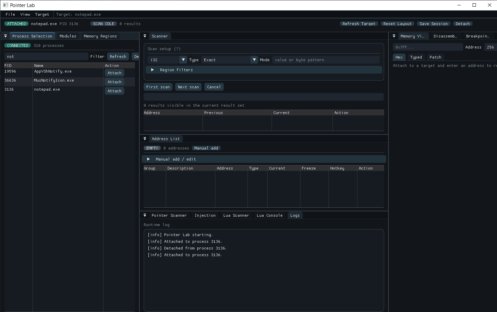

# Pointer Lab

A greenfield Windows C++20 user-mode memory research tool. Inspired by the broad workflow of Cheat Engine while intentionally avoiding kernel drivers, DBVM/hypervisor behavior, anti-anti-debugging, deep managed-runtime integration, overlays, and GPU pointer scanning.



## Build

```powershell
& "C:\Program Files\Microsoft Visual Studio\2022\Community\Common7\IDE\CommonExtensions\Microsoft\CMake\CMake\bin\cmake.exe" -S . -B build -G "Visual Studio 17 2022" -A x64
& "C:\Program Files\Microsoft Visual Studio\2022\Community\Common7\IDE\CommonExtensions\Microsoft\CMake\CMake\bin\cmake.exe" --build build --config Release
```

CMake fetches Dear ImGui (docking branch) and Lua 5.4.7 during configure. Everything else is native source in this repository.

## Features

- Process attach/detach, process list, module list, memory region map
- Remote read/write for primitives and raw bytes
- Exact, unknown-initial, changed, unchanged, increased, and decreased scans
- Address list with groups, descriptions, freeze loop, manual add/edit, and in-window F1–F12 hotkey toggles
- Module-relative pointer-chain search
- Hex memory viewer with patching
- Lightweight x86/x64 disassembly and basic assembler patching
- User-mode software breakpoint service using Windows debug APIs
- Remote allocation, remote thread creation, and LoadLibraryW injection helpers
- Embedded Lua 5.4 console with automation API
- Native `.iretable` save/load format, session file, ImGui layout persistence, logging, and crash logging
